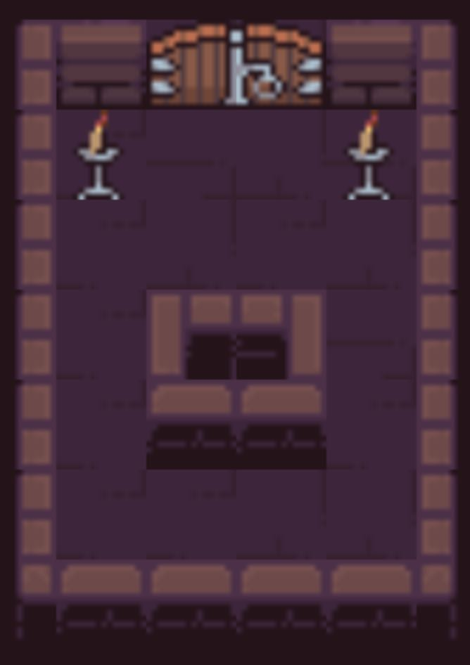

# TOSIOS (The Open-Source IO Shooter)

[](https://github.com/halftheopposite/tosios/blob/master/LICENSE) [](https://hub.docker.com/r/halftheopposite/tosios)

The Open-Source IO Shooter is an open-source multiplayer game in the browser. It is meant to be hostable and playable by (almost) anyone. This is not an attempt at creating an outstanding gaming experience, but to create an easily understandable and modifiable multiplayer browser game.


## 🕹️ Playing

You can play the game by following (and sharing) this link https://tosios-demo.herokuapp.com/.

**Rules**

The game principles are fairly easy to grasp:

1. Every player is positionned randomly on the map during the `lobby`.
2. When the `game` starts, each player must take down others.
3. There are some `potions` on the map that restore health.
4. The last one alive wins 🎉.

You can see a very small amount of gameplay below (the framerate of this GIF is low):


**Movements**

* Move: <kbd>W</kbd> <kbd>A</kbd> <kbd>S</kbd> <kbd>D</kbd> or <kbd>↑</kbd> <kbd>←</kbd> <kbd>↓</kbd> <kbd>→</kbd>.
* Aim: <kbd>Mouse</kbd>
* Shoot: <kbd>Left click</kbd> or <kbd>Space</kbd>

## 🚀 Running

You can build this game yourself easily if you are experienced with modern javascript development or Docker.

### Docker Compose

The easiest way to run the game is to use the `docker-compose.yml` file with the following command `docker-compose up -d`.

The `up` option will download the image if you don't have it yet and run the container.

The `-d` option will run the container in the background.

### Docker

You can also build the Docker image yourself:

1. Build it with `docker build -t tosios .`
2. Run it with `docker run -d -p 3001:3001 [IMAGE_ID]`

The `-d` option will run the container in the background (recommended if you want to have access to your current terminal session).

The `-p` option will let you choose on which port the container will listen (e.g. the first `3001` will make it accessible to http://localhost:3001), and on which internal port must the server listen (e.g. the second `3001`).

The `[IMAGE_ID]` is easily discoverable by running `docker images` in the terminal.

### Local

You can also build the game directly using `yarn` (you cannot use `npm install` as this repo is using the `workspace` feature of Yarn):

1. Install dependencies with `yarn`.
2. Build game with `yarn build`.
3. Run `yarn serve`.
4. The game is available at http://localhost:3001.

**Tips**

If you want to **play with friends** at work or home, you can run 
the following command to get your local network IP: `ipconfig getifaddr en0`. You can then share the obtained IP and port(ex: http://192.168.1.10:3001).

## 🔧 Development

To run the project in development:

1. Install dependencies with `yarn`.
2. Start game with `yarn start`.
3. The game is available at http://localhost:3001.

If you encounter a **white screen** the first time you try to load the game in the browser, that's normal, just refresh the page. This is due to the order in which things are built the first time at launch.

In development, the `front` application is NOT served by the `server`, thus requiring you to access it through port `3000` instead of `3001` as seen before.

In development changes made to `client` and `server` are live, except for the `common` module.

## Project architecture

This project is a monorepo (with the help of Yarn workspaces). It contains the following packages:

* `client` - The frontend application using `Create React App`, `PIXI.js` and `Colyseus.js`.
* `server` - The authoritarive server running on `NodeJS`, `Express` and `Colyseus`.
* `common` - A collection of constants and methods shared amongst `client` and `server`.

## Modding

### Maps

Anyone can create their own map pretty easily in TOSIOS.

Maps are composed of `arrays` of `arrays` where each number greater than `0` represents a `wall` to which entities will collide.

When creating a map each number represents a specific wall sprite that will be drawn:
* `1` for a wall on the left
* `2` for a wall on the top
* `3` for a wall on the right
* `4` for a wall on the bottom
* `5` for a wall on the bottom-left (concave angle)
* `6` for a wall on the bottom-right (concave angle)
* `7` for a wall on the top-left (convexe angle)
* `8` for a wall on the bottom-right (convexe angle)
* `9` for a left door
* `10` for a right door
* `11` for a torch

Example:

```js
  [
    [1, 2, 9, 10, 2, 3],
    [1, 11, 0, 0, 11, 3],
    [1, 0, 0, 0, 0, 3],
    [1, 0, 7, 8, 0, 3],
    [1, 0, 4, 4, 0, 3],
    [1, 0, 0, 0, 0, 3],
    [5, 4, 4, 4, 4, 6],
  ]
```

will render into



**Creating your own map**

If you want to add your own map to the game:

1. Add a new file in `package/common/maps` containing your map template as shown in the example (e.g. `package/common/maps/gigantic.ts`).
2. Open `package/common/maps/index.ts`, and add the following statements:
```typescript
///...
import gigantic from './gigantic';
//...
const MAPS = {
  //...
  gigantic,
};
//...
export const List: Types.IListItem[] = [
  //...
  { value: 'gigantic', title: 'Gigantic' }, // Used for the dropdown on the client
];
```
3. Open `package/common/types.ts`, and add your map `value` key to `MapNameType`:
```typescript
export type MapNameType = 'small' | 'long' | 'big' | 'gigantic';
```

## Roadmap for 1.0.0 (Q4 2019)

This is not an exhaustive, nor final, features list but it will give you a good indication on what I am working on:

* ~Let users select the number of players in a room.~ DONE
* ~Publish the docker image onto a registry and add a `docker-compose` file.~ DONE
* ~Add a playable demo website for anyone to test and play the game.~ DONE
* ~Add mobile mode (updated GUI and virtual joysticks).~ DONE
* ~Add visual feedback when a player gets hit.~ DONE
* ~Add smoother bullets.~ DONE
* ~Implement a R-Tree for performances.~ DONE
* Add players spawner object instead of randomized points.
* Add a Team Death Match mode.
* Add some monsters that attack all players.
* Add support for JSON TMX format (Tiled).

## Special thanks

Thanks to [@endel](https://github.com/endel) for his fabulous work on [Colyseus](https://github.com/colyseus/colyseus) that made this game possible.

Thanks to the [PIXI.js](https://github.com/pixijs/pixi.js) team for their incredible library and up-to-date documentation. 

Thanks to [@pixel_poem](https://twitter.com/pixel_poem) for the art package he published on Itch.io which made this game looks cool instantly.

## Licenses

This project is under the [MIT](https://github.com/halftheopposite/tosios/blob/master/LICENSE) license.

The major libraries and assets used in this project have the following licenses:

* Colyseus: [MIT](https://github.com/colyseus/colyseus/blob/master/LICENSE)
* PIXI.js: [MIT](https://github.com/pixijs/pixi.js/blob/dev/LICENSE)
* Font "Press Start 2P": [Creative Common Zero](http://www.zone38.net/font/)
