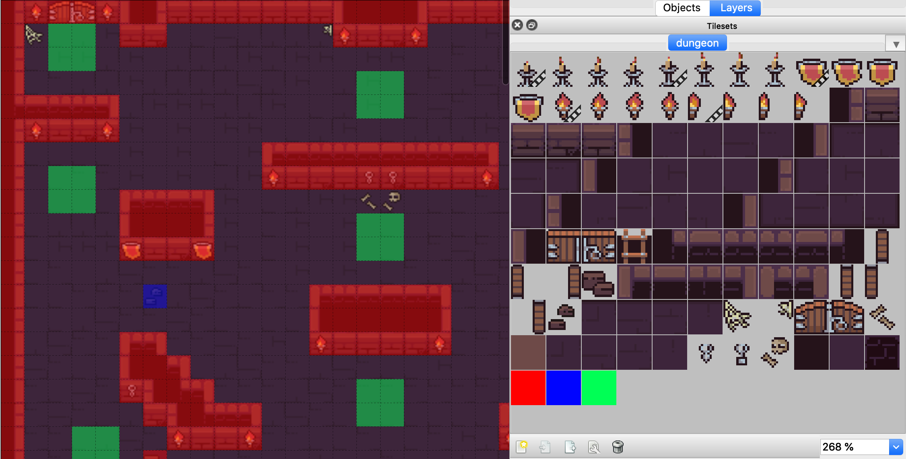
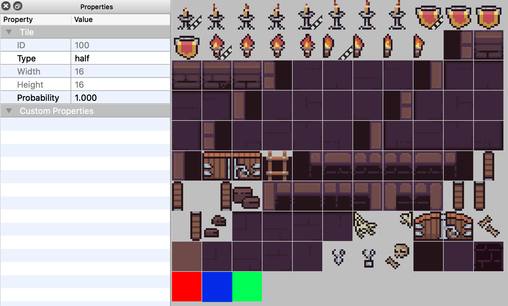

# <p align="center"></p>

[](https://github.com/halftheopposite/tosios/blob/master/LICENSE)
[](https://hub.docker.com/r/halftheopposite/tosios)


---

**Hello fellow game developer 🧙‍♂️!**

**I need less than 5 minutes of your precious time, feedback, and experience, to answer a few questions about multiplayer game development that will help me shape future projects. Survey is available at https://tally.so/r/w81Xr5 and requires no signup and no bs.**

---

The Open-Source IO Shooter is an open-source multiplayer game in the browser (desktop or browser). It is meant to be hostable and playable by anyone. This is not an attempt at creating an outstanding gaming experience, but to create an easily understandable and modifiable multiplayer browser game.

**Desktop version**


**Mobile version**


## 🕹️ Playing

Want to play right away? You can play the game by following (and sharing) this link https://tosios.online.

**Rules**

The game principles are fairly easy to grasp:

1. Every player is positionned randomly on the map during the `lobby`.
2. When the `game` starts, each player must take down others (either in death match, or team death match).
3. There are some `potions` on the map that restore health.
4. The last player (or team) alive wins 🎉.

You can see a very small amount of gameplay below (the framerate of this GIF is low):


**Movements**

- Move: <kbd>W</kbd> <kbd>A</kbd> <kbd>S</kbd> <kbd>D</kbd> or <kbd>↑</kbd> <kbd>←</kbd> <kbd>↓</kbd> <kbd>→</kbd>.
- Aim: <kbd>Mouse</kbd>
- Shoot: <kbd>Left click</kbd> or <kbd>Space</kbd>

## 🚀 Running

You can build this game yourself easily if you are experienced with modern javascript development or Docker.

### Docker Compose 🐋

The easiest way to run the game is to use the `docker-compose.yml` file with the following command `docker-compose up -d`.

The `up` option will download the image if you don't have it yet and run the container.

The `-d` option will run the container in the background.

### Docker 🐋

You can also build the Docker image yourself:

1. Build it with `docker build -t tosios .`
2. Run it with `docker run -d -p 3001:3001 [IMAGE_ID]`

The `-d` option will run the container in the background (recommended if you want to have access to your current terminal session).

The `-p` option will let you choose on which port the container will listen (e.g. the first `3001` will make it accessible to http://localhost:3001), and on which internal port must the server listen (e.g. the second `3001`).

The `[IMAGE_ID]` is easily discoverable by running `docker images` in the terminal.

### Local

You can also build the game directly using `yarn` (you cannot use `npm install` as this repo is using the `workspace` feature of Yarn):

1. Install dependencies with `yarn`.
2. Build game with `yarn build`.
3. Run `yarn serve`.
4. The game is available at http://localhost:3001.

**Tips**

If you want to **play with friends** at work or home, you can run
the following command to get your local network IP: `ipconfig getifaddr en0`. You can then share the obtained IP and port(ex: http://192.168.1.10:3001).

## 🔧 Development

To run the project in development:

1. Install dependencies with `yarn`.
2. Make a first build with `yarn build`
3. Start game with `yarn dev`.
4. The game is available at http://localhost:3001.

## Project architecture

This project is a monorepo (with the help of Yarn workspaces). It contains the following packages:

- `client` - The frontend application using `PIXI.js` and `Colyseus.js`.
- `server` - The authoritarive server running on `NodeJS`, `Express` and `Colyseus`.
- `common` - A collection of constants and methods shared amongst `client` and `server`.

## Modding

### Maps

Anyone can create their own map to use in TOSIOS.

#### How to create my map?

The maps available in TOSIOS have all been created thanks to [Tiled Map Editor](https://www.mapeditor.org/) (TME). You must first download this software in order to start creating your own map. I also invite you to read some tutorial for an easier beginning.

The most important concepts to create a functional map are `layers` and `tilesets` (I invite you to open one of the existing map in TME to familiarize yourself with how maps are structured. It will make things 10x easier if you have a living example under your eyes).

**Layers**

A `layer` is where your tiles are placed to form a map. You can combine multiple `layers` on top of each other so that you can get a crate over a ground tile, or a spider web over a wall for example.

There are two reserved layers that should be present at all time (although not rendered):

- `collisions`: for the client and server to know where the player can move or not (ex: walls or pits), or shoot through (ex: pits or small rocks).
- `spawners`: for the server to determine the starting position of a player.

Other than that, you can add as many `layers` as you want and they will be rendered by `PIXI.js` in a WYSIWYG manner (order is maintained).

Although in the `dungeon.png` spritesheet I use colored tiles to represent `collisions` (red and blue) and spawners (green), you can use any tile you want as it won't be rendered anyway.



**Tilesets**

The `tilesets` is where lie the splitted spritesheet and its collision, animated and spawner tiles.

When defining which tile will be used for collisions it is very important to set its `type` field to either:

- `half`: a `player` CAN'T go through, but a `bullet` CAN go through.
- `full`: a `player` CAN'T go through, and a `bullet` CAN'T go through.

This can be done by selecting a tile in the tilesets editor, and entering its `type` on the left pane.



#### How to add my map to the game?

If you want to add your map to the game:

1. If you have a custom spritesheet image, add it in `/packages/client/src/images/maps/custom.png`
2. Open `/packages/client/src/images/maps/index.ts`, and add the following statements:

```typescript
import gigantic from "./gigantic.png";
import custom from "./custom.png"; // <- Add this line

export const SpriteSheets: { [key: string]: string } = {
  "dungeon.png": dungeon,
  "custom.png": custom, // <- Add this line
};
```

3. Add your map file (TMX as JSON) in `/packages/common/maps/custom.json`.
4. Open `/packages/common/maps/index.ts`:

```typescript
// ...
import gigantic from "./gigantic.json";
import custom from "./custom.json"; // <- Add this line

export const List: { [key: string]: TMX.IMap } = {
  gigantic,
  custom, // <- Add this line
};
```

5. Open `/packages/common/constants.ts`:

```typescript
// ...
export const MAPS_NAMES = ["gigantic", "custom"]; // <- Add this entry
// ...
```

## Roadmap for v1.0.0

This is not an exhaustive, nor final, features list but it will give you a good indication on what I am working on:

- [x] Let users select the number of players in a room.
- [x] Publish the docker image onto a registry and add a `docker-compose` file.
- [x] Add a playable demo website for anyone to test and play the game.
- [x] Add mobile mode (updated GUI and virtual joysticks).
- [x] Add visual feedback when a player gets hit.
- [x] Add smoother bullets.
- [x] Implement a R-Tree for performances.
- [x] Add players spawner object instead of randomized points.
- [x] Add support for JSON TMX format (Tiled).
- [x] Add a Team Death Match mode.
- [x] Add some monsters. (Q1 2020)
- [x] Improve the UI of the game menu. (Q2 2020)
- [x] Improve particle effects. (Q3 2020)
- [x] Add analytics
- [x] Add sound effects. (Q3 2020)
- [ ] Add powers up and pickable items.
- [ ] Add ground monster.
- [ ] Add random dungeon generation.

## Special thanks

Thanks to [@endel](https://github.com/endel) for his fabulous work on [Colyseus](https://github.com/colyseus/colyseus) that made this game possible.

Thanks to the [PIXI.js](https://github.com/pixijs/pixi.js) team for their incredible library and up-to-date documentation.

Thanks to [@pixel_poem](https://twitter.com/pixel_poem) for the art package he published on Itch.io which made this game looks cool instantly.

Thanks to [@thorbjorn81](https://twitter.com/thorbjorn81) for the many years of work on the [Tiled](https://github.com/bjorn/tiled) map editor.

## Licenses

This project is under the [MIT](https://github.com/halftheopposite/tosios/blob/master/LICENSE) license.

The major libraries and assets used in this project and their licenses:

- Colyseus: [MIT](https://github.com/colyseus/colyseus/blob/master/LICENSE)
- PIXI.js: [MIT](https://github.com/pixijs/pixi.js/blob/dev/LICENSE)
- Font "Press Start 2P": [Creative Common Zero](http://www.zone38.net/font/)
